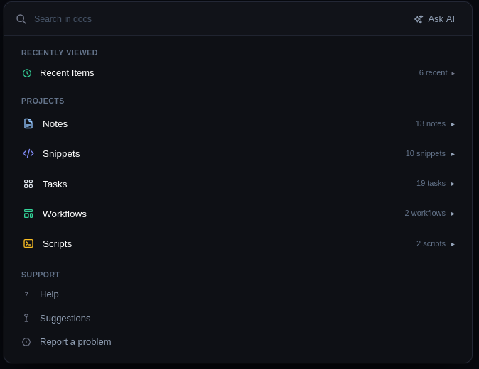

# DyFlow

> **⚠️ This project is under construction. Features and structure may change.**



## Description

**DyFlow** is a desktop application to manage your daily workflow. Organize quick notes, code snippets, daily tasks, workflows, and scripts with intelligent search powered by AI.

## Features

- **Notes** — Quick notes with search
- **Snippets** — Reusable text or code snippets
- **Tasks** — Daily task management with priorities
- **Workflows** — Automated task sequences
- **Scripts** — Scheduled script execution (cron jobs)
- **AI Search** — Intelligent search powered by AI

## Architecture

### Frontend (PySide6) — MVC
```
dyflow/
├── models/          # Data models (dataclasses)
├── ui/              # PySide6 views (UI)
│   ├── main_window.py
│   └── widgets/
└── utils/           # Utilities
```

### Backend (Rust) — Clean Architecture
```
rust/src/
├── domain/              # Entities and business rules
│   ├── entities/
│   └── errors/
├── application/         # Services and DTOs
│   ├── services/
│   └── dto/
└── infrastructure/      # Storage and external services
    ├── storage/
    └── ai/
```

## Tech Stack

- **Frontend**: PySide6 (Qt for Python)
- **Backend**: Rust + PyO3 + maturin
- **UI**: Dark theme sidebar with sections

## Installation

```bash
git clone git@github.com:lebuas/dyflow.git
cd dyflow
python -m venv .venv
source .venv/bin/activate
pip install maturin
maturin develop
pip install PySide6
```

## Usage

```bash
py dyflow.py
```

## License

MIT
